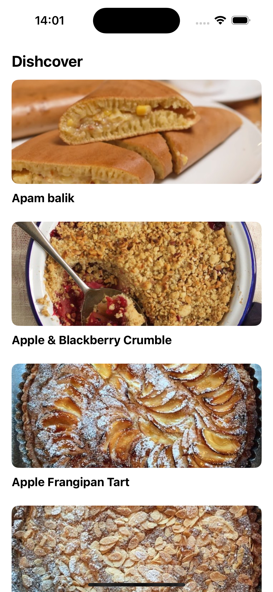
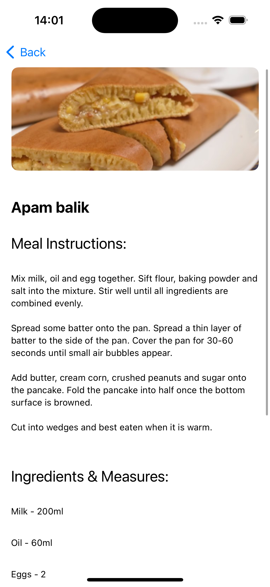
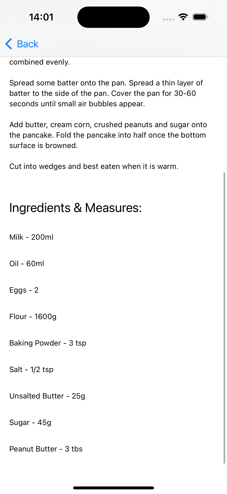

# Dishcover
Dishcover is an iOS application designed to help you uncover delightful dessert recipes for your next culinary journey in the comfort of your own kitchen.

## Screenshots 

    
        
    

## Technologies and Stack  
Swift, SwiftUI, MVVM, Mock Environment & Live Environment, Image Caching, Networking using URLSession and Swift Async/Await
